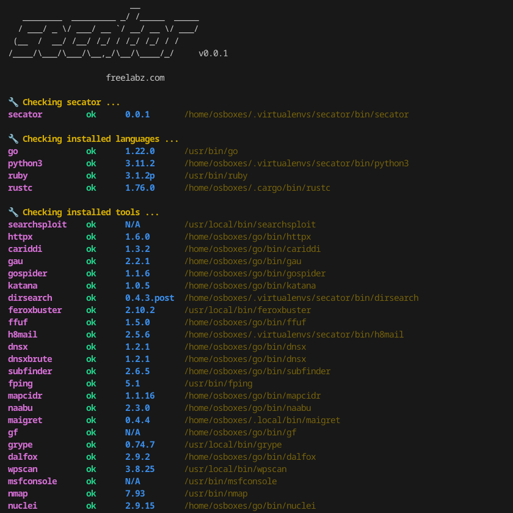

# Installation

***

## Installing secator



```bash
pipx install secator
```



```bash
pip install secator
```



```bash
wget -O - https://raw.githubusercontent.com/freelabz/secator/main/scripts/install.sh | sh
```



```bash
docker run -it --rm --net=host -v ~/.secator:/root/.secator freelabz/secator --help
```


The volume mount `-v` is necessary to save all `secator` reports to your host machine, and`--net=host` is recommended to grant full access to the host network.


You can alias this command to run it easier:

```
alias secator="docker run -it --rm --net=host -v ~/.secator:/root/.secator freelabz/secator"
```

Now you can run `secator` like if it was installed on baremetal:

```
secator --help
```



<pre class="language-bash"><code class="lang-bash">git clone https://github.com/freelabz/secator
cd secator
<strong>docker-compose up -d
</strong><strong>docker-compose exec secator secator --help
</strong></code></pre>




If you chose the Bash, Docker, or Docker Compose installation methods, you can jump straight to [cli-usage.md](cli-usage.md "mention").


***

## Installing languages

`secator` uses external tools, so you might need to install languages used by those tools assuming they are not already installed on your system.

We provide a subcommand to install required languages if you don't manage them externally:

<pre class="language-bash"><code class="lang-bash"><strong>secator install langs go   # install Go
</strong>secator install langs ruby # install Ruby
</code></pre>

***

## Installing tools

`secator` does not install any of the external tools it supports by default.

We provide a subcommand to install or update each supported tool which should work on all systems supporting `apt`:

```bash
secator install tools httpx  # install httpx
secator install tools        # install all supported tools
```

***

## Installing addons

`secator` comes installed with the minimum amount of dependencies.

We provide a subcommand to install additional addons which are required for various features:



Add support for Celery (see [distributed-runs-with-celery.md](../in-depth/distributed-runs-with-celery.md "mention")).

```sh
secator install addons worker
```



Add support for Google Drive exporter (see [exporters.md](../in-depth/concepts/exporters.md "mention")).

```sh
secator install addons google
```



Add support for MongoDB driver (see [#mongodb-driver](../in-depth/concepts/drivers.md#mongodb-driver "mention")).

```sh
secator install addons mongodb
```



Add support for Celery Redis broker / backend.

```sh
secator install addons redis
```



Add development tools like `coverage` and `flake8` required for running tests.

```sh
secator install addons dev
```



Add tracing tools like `memray` and `pyinstrument` required for tracing functions.

```sh
secator install addons trace
```



***

## Installing CVEs

`secator` makes remote API calls to [https://cve.circl.lu/](https://cve.circl.lu/) to get in-depth information about the CVEs it encounters.

We provide a subcommand to download all known CVEs locally so that future lookups are made from disk instead:

```bash
secator install cves
```

***

## Checking installation health

To figure out which languages or tools are installed on your system (along with their version):

```bash
secator health
```

<figure><figcaption></figcaption></figure>

