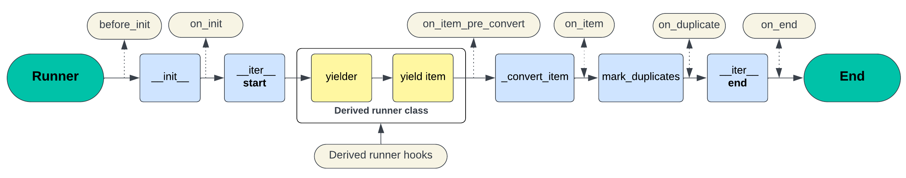

# Runners

A runner is at the core of `secator` live processing capabilities. It handles the parsing, converting and processing of input options (CLI and library) and output items.

All runners inherit from `secator.runners._base.Runner`.

***

## Supported runners

Some built-in runners are available out-of-the-box:

<table><thead><tr><th width="134">Runner</th><th width="334">Description</th><th>Additional features</th></tr></thead><tbody><tr><td><strong>Command</strong></td><td>Run an external command and stream it's output.</td><td><ul><li>Automatic command install.</li><li>Priviledged mode (<code>sudo</code>).</li></ul></td></tr><tr><td><strong>Task</strong></td><td>Run a task.</td><td><ul><li>Remote mode (Celery).</li><li>Chunking on big inputs.</li><li>Direct calling from library.</li></ul></td></tr><tr><td><strong>Workflow</strong></td><td>Run a DAG of tasks, defined in a YAML config file.</td><td><ul><li>Remote mode (Celery).</li><li>Distributed (Celery).</li><li>Task chaining and parallel.</li><li>Re-use previous results as task inputs.</li></ul></td></tr><tr><td><strong>Scan</strong></td><td>Run a DAG of workflows, defined in a YAML config file.</td><td><ul><li>Distributed (Celery).</li><li>Workflow chaining.</li><li>Re-use previous results as workflow inputs.</li></ul></td></tr></tbody></table>

***

## Lifecyle hooks

Here is an overview of how a runner's lifecycle:

<figure><figcaption><p>Runner lifecycle</p></figcaption></figure>

The `Runner` lifecycle contains hooks that a user can plug into:

**Base hooks:**

* `before_init`: executed before the base runner's init starts.
* `on_init`: executed when the base runner's init is completed.
* `on_start` : executed when the runner has started running.
* `on_iter`: executed when the runner iterates.
* `on_end` : executed when the runner has finished running.
* `on_cmd`: runs when the mapped command is built <mark style="color:red;">**\[**</mark><mark style="color:red;">** **</mark><mark style="color:red;">**`Command`**</mark><mark style="color:red;">** **</mark><mark style="color:red;">**runner only ]**</mark>.
* `on_start`: executed when command is ready and about to run <mark style="color:red;">**\[**</mark><mark style="color:red;">** **</mark><mark style="color:red;">**`Command`**</mark><mark style="color:red;">** **</mark><mark style="color:red;">**runner only ]**</mark>.

**Item hooks:**

* `on_item_pre_convert`: executed before an item is converted to an output type.
* `on_item`: executed when the runner emits an item.
* `on_duplicate`: runs after an item has been marked as a duplicate.
* `on_line`: executed when a line is emitted to `stdout` <mark style="color:red;">**\[**</mark><mark style="color:red;">** **</mark><mark style="color:red;">**`Command`**</mark><mark style="color:red;">** **</mark><mark style="color:red;">**runner only ]**</mark>.
* `on_error`: executed when an error is emitted by the command <mark style="color:red;">**\[**</mark><mark style="color:red;">** **</mark><mark style="color:red;">**`Command`**</mark><mark style="color:red;">** **</mark><mark style="color:red;">**runner only ]**</mark> .


All hooks take **`self`** as the **first** argument so that you can use the runner data in your hook implementation.



Item hooks take **`item`** as the **second** argument and expect you to return the modified item.


***

## Using hooks

There are two different ways of specifying hooks: **static hooks** (in the task definition class), **dynamic hooks** (passed to a runner at runtime), or **drivers**.

### Static hooks

Static hooks **are** specified in the task specification class as `staticmethod`s:

```python
from secator.runners import Command
from secator.decorators import task
from mylib import send_to_aws_s3


@task()
class mytool(Command):
    # ...

    @staticmethod
    def on_item(self, item):
        if item._type == 'url':
            send_to_aws_s3(item.stored_response_path)
        return item
```

### Dynamic hooks

Dynamic hooks are specified at runtime by passing them to a runner.


Dynamic hooks are a **library-only** feature, they are not available in the CLI.


Here are examples of specifying dynamic hooks:



<pre class="language-python"><code class="lang-python">from secator.task import mytool

api_url = 'https://myapi.com'
hooks = {
    'on_item': lambda self, item: requests.post(api_url, json=item.toDict())
}
<strong>mytool('TARGET', hooks=hooks).run()
</strong></code></pre>



```python
from secator.runners import Workflow, Task
from secator.template import TemplateLoader
from secator.hooks.mongodb import update_runner, update_finding

config = TemplateLoader(path='/path/to/my/workflow.yaml')
workflow = Workflow(
    config,
    hooks={
       Workflow: {
            'on_init': [update_runner],
            'on_start': [update_runner],
            'on_iter': [update_runner],
            'on_end': [update_runner]
        },
        Task: {
            'on_init': [update_runner],
            'on_item': [update_finding],
            'on_duplicate': [update_finding],
            'on_iter': [update_runner],
            'on_end': [update_runner]
        }
    }
)
workflow.run()
```



### **Drivers**

See [#drivers](runners.md#drivers "mention").

***
