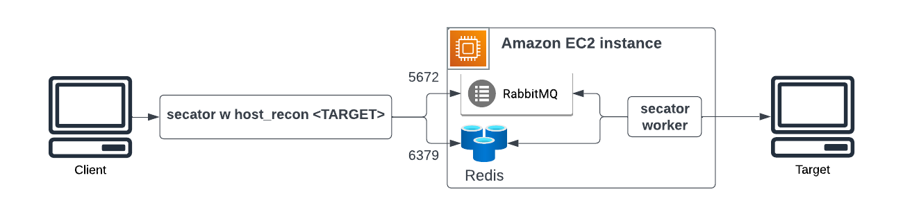

# Deployment

Once you have started using `secator` locally, you can deploy it on remote instances.

***

## Amazon Web Services (AWS)

_Amazon Web Services_ (AWS) is a subsidiary of Amazon that provides on-demand cloud computing platforms and APIs to individuals, companies.

### Elastic Compute Cloud

#### Deploy on a single EC2 instance

<figure><figcaption><p>Deployment on a single EC2 instance</p></figcaption></figure>

To deploy `secator` on AWS on a single EC2 instance, we will install RabbitMQ, Redis and a Celery worker running `secator` on the instance.

<details>

<summary>Step 1: Create an EC2 instance with AMI Ubuntu</summary>

* Go to the AWS Management Console
* Create an EC2 instance using the Ubuntu AMI
* Configure **Security Groups:**
  * Allow port 6379 (Redis)
  * Allow port 5672 (RabitMQ)
* SSH to your created instance

</details>

<details>

<summary>Step 2: Install RabbitMQ as a task broker</summary>

```bash
sudo apt-get install curl gnupg apt-transport-https -y
curl -1sLf "https://keys.openpgp.org/vks/v1/by-fingerprint/0A9AF2115F4687BD29803A206B73A36E6026DFCA" | sudo gpg --dearmor | sudo tee /usr/share/keyrings/com.rabbitmq.team.gpg > /dev/null
curl -1sLf "https://keyserver.ubuntu.com/pks/lookup?op=get&search=0xf77f1eda57ebb1cc" | sudo gpg --dearmor | sudo tee /usr/share/keyrings/net.launchpad.ppa.rabbitmq.erlang.gpg > /dev/null
curl -1sLf "https://packagecloud.io/rabbitmq/rabbitmq-server/gpgkey" | sudo gpg --dearmor | sudo tee /usr/share/keyrings/io.packagecloud.rabbitmq.gpg > /dev/null
sudo apt-get update -y
sudo apt-get install -y erlang-base \
    erlang-asn1 erlang-crypto erlang-eldap erlang-ftp erlang-inets \
    erlang-mnesia erlang-os-mon erlang-parsetools erlang-public-key \
    erlang-runtime-tools erlang-snmp erlang-ssl \
    erlang-syntax-tools erlang-tftp erlang-tools erlang-xmerl
sudo apt-get install rabbitmq-server -y --fix-missing
sudo rabbitmq-plugins enable rabbitmq_management
sudo rabbitmqctl add_user secator <RABBITMQ_PASSWORD>
sudo rabbitmqctl set_user_tags secator administrator
sudo rabbitmqctl set_permissions -p / secator ".*" ".*" ".*"
```

**Make sure your replace the \<RABBITMQ\_PASSWORD> by a strong password that you generate.**

</details>

<details>

<summary>Step 3: Install Redis as a storage backend</summary>

Celery needs a storage backend to store results. `secator` uses the storage backend to print results in real-time.

```bash
sudo apt install redis-server
sudo vi /etc/redis/redis.conf
# set requirepass to <REDIS_PASSWORD>
# comment the "bind 127.0.0.1 ::1" line
# change "protected-mode" to "no"

sudo /etc/init.d/redis-server restart
```

**Make sure your replace the \<REDIS\_PASSWORD> by a strong password that you generate.**

</details>

<details>

<summary>Step 4: Deploy a secator worker</summary>

First, setup `secator`using the all-in-one bash setup script:

```
wget -O - https://raw.githubusercontent.com/freelabz/secator/main/scripts/install.sh | sh
```

Now, let's configure the worker `.env` with RabbitMQ and Redis connection details:


```bash
CELERY_BROKER_URL=amqp://secator:<RABBITMQ_PASSWORD>@localhost:5672/
CELERY_RESULT_BACKEND=redis://default:<REDIS_PASSWORD>@localhost:6379/0
```


Now we can run a `secator worker`:

```
nohup secator worker > worker.log 2>&1 &  # start in background and save logs
```

</details>

<details>

<summary>Step 5: Run a task from your local machine</summary>

Let's configure the worker `.env` with RabbitMQ and Redis connection details:


```bash
CELERY_BROKER_URL=amqp://secator:<RABBITMQ_PASSWORD>@<EC2_PUBLIC_IP>:5672/
CELERY_RESULT_BACKEND=redis://default:<REDIS_PASSWORD>@<EC2_PUBLIC_IP>:6379/0
```


Run a test task:

```
secator x httpx wikipedia.org
```

You should get an output like the following:

```bash
                         __            
   ________  _________ _/ /_____  _____
  / ___/ _ \/ ___/ __ `/ __/ __ \/ ___/
 (__  /  __/ /__/ /_/ / /_/ /_/ / /    
/____/\___/\___/\__,_/\__/\____/_/     v0.0.1

                    freelabz.com

Celery worker is alive !
╭──────── Task httpx ─────────╮
│ 📜 Description: DotMap()    │
│ 👷 Workspace: default       │
│ 🍐 Targets:                 │
│    • wikipedia.org          │
│ 📌 Options:                 │
│    • follow_redirect: False │
│    • threads: 50            │
│    • debug_resp: False      │
╰─────────────────────────────╯
[10:20:54] 🎉 Task httpx sent to Celery worker...                                                                                                                                        _base.py:614
🏆 Live results:
🔗 https://wikipedia.org [301] [301 Moved Permanently] [mw1415.eqiad.wmnet] [HSTS] [text/html] [234]
```

</details>

#### Deploy on multiple EC2 instances

If you want a more scaleable architecture, we recommend deploying RabbitMQ, Redis, and Celery workers on different EC2 instances.

The steps are exactly the same as for [#deploy-on-a-single-ec2-instance](deployment.md#deploy-on-a-single-ec2-instance "mention"), expect that steps 2, 3, and **4** will each be run on **separate EC2 instance**.&#x20;

You can repeat step 4 on more instances to increase the number of workers.

***

## Google Cloud Platform (GCP) \[WIP]

The _Google Cloud Platform_ (GCP) is a suite of cloud services that offers server space on virtual machines, internal networks, VPN connections, disk storage, ...

### Google Compute Engine

#### Deploy on a single GCE instance

<figure><figcaption><p>Deployment on a single EC2 instance</p></figcaption></figure>

To deploy `secator` on a single GCE machine, we will install RabbitMQ, Redis and a Celery worker running `secator` on the instance.

<details>

<summary>Step 1: Create a GCE instance</summary>

* Go to the Google Cloud Console
* Create a GCE instance using the Debian image
* Create firewall rules in **Network** > **Firewall:**
  * Allow port 6379 (Redis)
  * Allow port 5672 (RabbitMQ)
* SSH to your created instance

</details>

<details>

<summary>Step 2: Install RabbitMQ as a task broker</summary>

```bash
sudo apt-get install curl gnupg apt-transport-https -y
curl -1sLf "https://keys.openpgp.org/vks/v1/by-fingerprint/0A9AF2115F4687BD29803A206B73A36E6026DFCA" | sudo gpg --dearmor | sudo tee /usr/share/keyrings/com.rabbitmq.team.gpg > /dev/null
curl -1sLf "https://keyserver.ubuntu.com/pks/lookup?op=get&search=0xf77f1eda57ebb1cc" | sudo gpg --dearmor | sudo tee /usr/share/keyrings/net.launchpad.ppa.rabbitmq.erlang.gpg > /dev/null
curl -1sLf "https://packagecloud.io/rabbitmq/rabbitmq-server/gpgkey" | sudo gpg --dearmor | sudo tee /usr/share/keyrings/io.packagecloud.rabbitmq.gpg > /dev/null
sudo apt-get update -y
sudo apt-get install -y erlang-base \
    erlang-asn1 erlang-crypto erlang-eldap erlang-ftp erlang-inets \
    erlang-mnesia erlang-os-mon erlang-parsetools erlang-public-key \
    erlang-runtime-tools erlang-snmp erlang-ssl \
    erlang-syntax-tools erlang-tftp erlang-tools erlang-xmerl
sudo apt-get install rabbitmq-server -y --fix-missing
sudo rabbitmq-plugins enable rabbitmq_management
sudo rabbitmqctl add_user secator <RABBITMQ_PASSWORD>
sudo rabbitmqctl set_user_tags secator administrator
sudo rabbitmqctl set_permissions -p / secator ".*" ".*" ".*"
```

**Make sure your replace the \<RABBITMQ\_PASSWORD> by a strong password that you generate.**

</details>

<details>

<summary>Step 3: Install Redis as a storage backend</summary>

Celery needs a storage backend to store results. `secator` uses the storage backend to print results in real-time.

```bash
sudo apt install redis-server
sudo vi /etc/redis/redis.conf
# set requirepass to <REDIS_PASSWORD>
# comment the "bind 127.0.0.1 ::1" line
# change "protected-mode" to "no"

sudo /etc/init.d/redis-server restart
```

**Make sure your replace the \<REDIS\_PASSWORD> by a strong password that you generate.**

</details>

<details>

<summary>Step 4: Deploy a secator worker</summary>

First, setup `secator`using the all-in-one bash setup script:

```
wget -O - https://raw.githubusercontent.com/freelabz/secator/main/scripts/install.sh | sh
```

Now, let's configure the worker `.env` with RabbitMQ and Redis connection details:


```bash
CELERY_BROKER_URL=amqp://secator:<RABBITMQ_PASSWORD>@localhost:5672/
CELERY_RESULT_BACKEND=redis://default:<REDIS_PASSWORD>@localhost:6379/0
```


Now we can run a `secator worker`:

```
nohup secator worker > worker.log 2>&1 &  # start in background and save logs
```

</details>

<details>

<summary>Step 5: Run a task from your local machine</summary>

Let's configure the worker `.env` with RabbitMQ and Redis connection details:


```bash
CELERY_BROKER_URL=amqp://secator:<RABBITMQ_PASSWORD>@<GCE_PUBLIC_IP>:5672/
CELERY_RESULT_BACKEND=redis://default:<REDIS_PASSWORD>@<GCE_PUBLIC_IP>:6379/0
```


Run a test task:

```
secator x httpx wikipedia.org
```

You should get an output like the following:

```bash
                         __            
   ________  _________ _/ /_____  _____
  / ___/ _ \/ ___/ __ `/ __/ __ \/ ___/
 (__  /  __/ /__/ /_/ / /_/ /_/ / /    
/____/\___/\___/\__,_/\__/\____/_/     v0.0.1

                    freelabz.com

Celery worker is alive !
╭──────── Task httpx ─────────╮
│ 📜 Description: DotMap()    │
│ 👷 Workspace: default       │
│ 🍐 Targets:                 │
│    • wikipedia.org          │
│ 📌 Options:                 │
│    • follow_redirect: False │
│    • threads: 50            │
│    • debug_resp: False      │
╰─────────────────────────────╯
[10:20:54] 🎉 Task httpx sent to Celery worker...                                                                                                                                        _base.py:614
🏆 Live results:
🔗 https://wikipedia.org [301] [301 Moved Permanently] [mw1415.eqiad.wmnet] [HSTS] [text/html] [234]
```

</details>

#### Deploy on multiple GCE instances

If you want a more scaleable architecture, we recommend deploying RabbitMQ, Redis, and Celery workers on different machines.

The steps are exactly the same as for [#deploy-on-multiple-gce-instances](deployment.md#deploy-on-multiple-gce-instances "mention"), expect that steps 2, 3, and **4** will each be run on **separate GCE instance**.&#x20;

You can repeat step 4 on more instances to increase the number of workers.

### Google Kubernetes Engine \[WIP]

### Cloud Run \[WIP]

***

## Axiom \[WIP]

**Axiom is a dynamic infrastructure framework** to efficiently work with multi-cloud environments, build and deploy repeatable infrastructure focussed on offensive and defensive security.

***

## Bare metal \[WIP]

### Kubernetes

### Docker-compose
