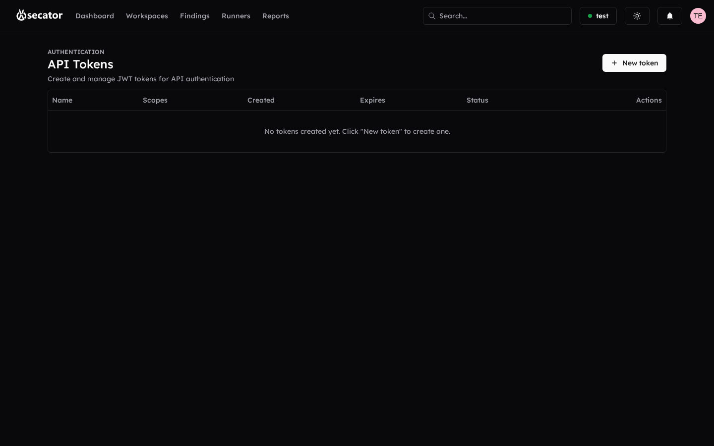

# API tokens

Programmatic access to the Secator API is gated by tokens you manage from the **API Tokens** page in the user menu. You can:

- **List tokens** with their name, scopes, creation date, expiration, and status (active, expired, revoked).
- **Create token** — Set a name, choose scopes (read / write / admin and finer-grained), and pick an expiration (preset durations of 7d, 30d, 90d, 1 year, or a custom date). The token value is shown **once** at creation — copy it immediately.

> [!caution]
> The token value cannot be recovered after the creation dialog is dismissed. If you lose it, you must revoke and recreate the token. Treat it like a password — keep it out of git, CI logs, and shared docs.

- **Edit** name and scopes of existing tokens.
- **Delete** (revoke) a token with confirmation.
- **Filter** the list by status.
