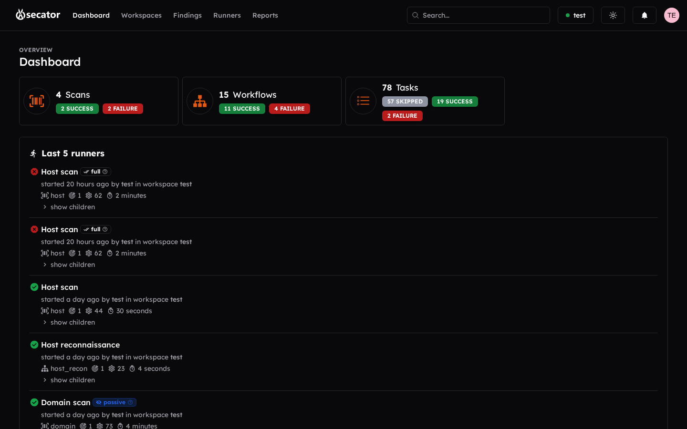

# Dashboard

The dashboard is your activity overview for the current workspace. You can:

- **Create a new workspace** if none exists yet.
- **See findings broken down by severity** (Critical, High, Medium, Low, Info). Click any segment to jump to the matching filter on the Findings page.
- **See runner status summaries** for Scans, Workflows, and Tasks. Click a status badge to filter the Runners page by that status.
- **See the last 5 runners** with their status and start time. Click a row to open the runner.
