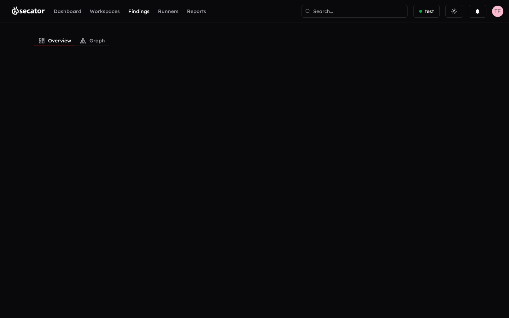

# Findings

Findings are the structured results produced by your runs. The Findings page has a tab per finding type and shows them in a sortable, filterable table.

> [!note]
> The tabs you see on this page are not arbitrary categories — each one corresponds to a **structured output schema** that every tool emits. When `katana`, `gospider` and `gau` all surface the same URL, the platform recognises them as the same `url` object and merges them into a single row, while still tracking *which* tools found it (you'll see all three in the *Source* column). The same dedup applies cross-tool to vulnerabilities (matched on CVE + target), ports (host + port + protocol), certificates (fingerprint), and so on. This is why a workspace that ran 9 workflows shows a clean unified findings list rather than 9 raw outputs to merge by hand.

### Finding types you can browse

| Type | What it represents | Source tools (examples) |
|---|---|---|
| **Vulnerability** | A detected issue on a target — CVE, misconfiguration, weak TLS, exposed panel, default credential, XSS, SQLi, SSRF, takeover candidate, etc. Carries severity, CVSS, CVE refs, evidence, and a `confidence` score. | `nuclei`, `dalfox`, `wpscan`, `wpprobe`, `trivy`, `grype`, `testssl`, `sshaudit`, `bbot`, `nmap` scripts |
| **Exploit** | A known public exploit matched against a detected product/version, with a link to its source (ExploitDB, Metasploit module, GitHub PoC). | `searchsploit`, `search_vulns`, `msfconsole` |
| **Domain / Subdomain** | DNS asset discovered for the engagement, with resolved IPs and registration data. | `subfinder`, `dnsx`, `jswhois` |
| **IP** | An IPv4/IPv6 address discovered through DNS resolution, ASN lookup, or network discovery, plus open ports and ASN owner. | `dnsx`, `getasn`, `arpscan`, `fping`, `mapcidr` |
| **Port** | An open service on a host, with banner, protocol, and detected product/version. | `nmap`, `naabu` |
| **URL** | A web endpoint with HTTP status, content-type, length, screenshot, detected technologies, and `is_root` / `verified` flags. | `httpx`, `katana`, `gospider`, `cariddi`, `gau`, `xurlfind3r`, `urlfinder`, `feroxbuster`, `dirsearch`, `ffuf` |
| **Tag** | A semantic marker attached to a finding (e.g. `email_address`, `aws_key`, `juicy_extension`, `pattern:sqli`). | Generated by `cariddi`, `gf`, `trufflehog`, `gitleaks` |
| **Record** | A raw HTTP request/response pair, with stored body and screenshot path, used as evidence for vulnerability findings. | `httpx`, `katana`, `dalfox`, `nuclei` |
| **User Account** | An identity discovered for a target — email, username, social profile, breach mention. | `h8mail`, `maigret` |
| **Certificate** | A TLS certificate with issuer, validity range, SANs, and weakness flags. | `testssl`, `httpx` |

### Actions on the Findings page

- **Switch tabs** to change the finding type displayed.
- **Search** by free text.
- **Filter** with a query panel that supports MongoDB-style operators (`$regex`, `$ne`, `$in`, `$nin`, etc.) — useful for advanced triage.
- **Sort** by any column.
- **Select** one or many findings via checkboxes (with select-all).
- **Bulk actions** on the selection — mark as false positive, reopen, or update status.
- **Click a finding** to open the detail panel: full description, evidence, request/response, screenshots, source scanner, CVSS, CVE, severity, status, and links to impacted targets and the runners that found it.

### Visualisations

Two specialized views help you make sense of large result sets:

- **Sitemap** — Tree view of discovered URLs grouped by path. Click any node to filter the URL findings to that prefix.
- **Infrastructure force graph** — 3D force-directed graph showing relationships between domains, IPs, ports, certificates, and targets. Pan and zoom with the mouse, click a node to focus, and use it to spot exposed assets at a glance.

### Badges you will see on findings

Severity, CVSS score, CVE, source scanner, HTTP status code, content type and length, detected technologies, and HTTP method.

A *single* finding details page (`Finding details`) is also available for sharing direct links — it shows everything the inline panel does but as a full page.
