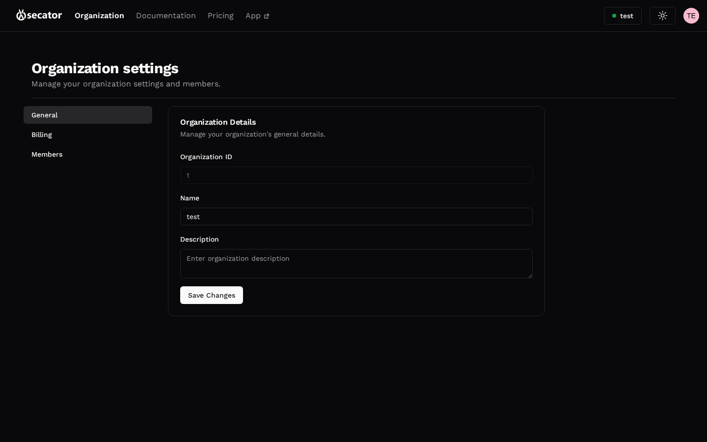

# Profile, organization, billing

Accessible from the user menu in the top-right corner. Most of these screens live in the Cloud UI and open in the same tab via a transparent redirect:

- **Profile** — Your name, avatar, email, password.
- **Organization** — Members, invitations, roles, and organization-level settings.
- **API Keys** — Same page as [API tokens](api-tokens.md).
- **Run hours** — Visible in the user menu; tracks consumption against your plan.
- **Logout** — Ends your session and returns you to the auth page.
