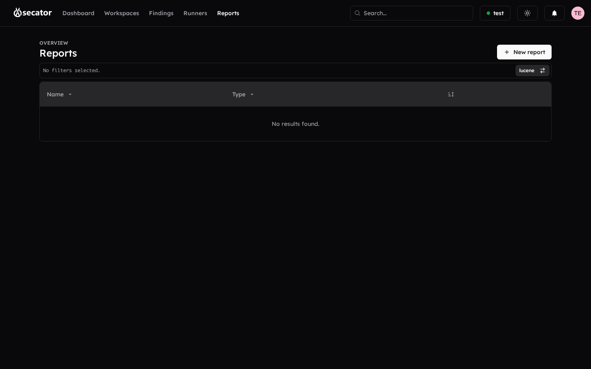

# Reports

Reports turn your findings into a deliverable for your client.

### Report list

- View, search, sort, paginate all reports in your workspace.
- **Create report** opens the editor.
- **Edit**, **delete**, **preview**, and **download** are available from the row actions.

### Report editor

Build the report by selecting what to include:

- **Workspace** — Pick the source workspace.
- **Report name** and **company name** — Free text.
- **Description / executive summary** — Rich text areas with editable templates.
- **Findings selection** — Multi-select per finding type:
  - Vulnerabilities
  - Hosts / targets
  - Ports
  - Tags
  - Subdomains
- **Live preview** — A formatted preview is shown using the same styling as the exported document.
- **Save / Update** — Stores the report so you can keep iterating.
- **Delete** — Removes the report.

The rendered report includes a company header, severity breakdown, finding counts, and detailed sections per finding (description, evidence, screenshots, remediation).
