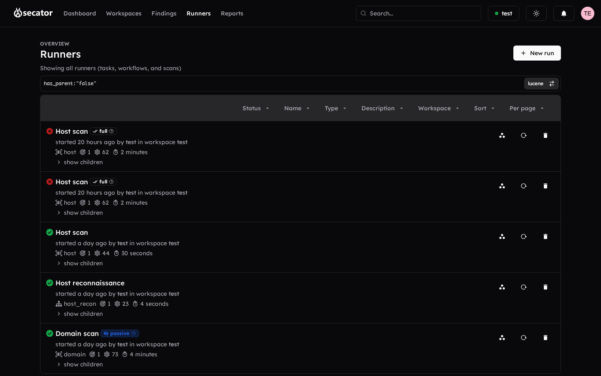
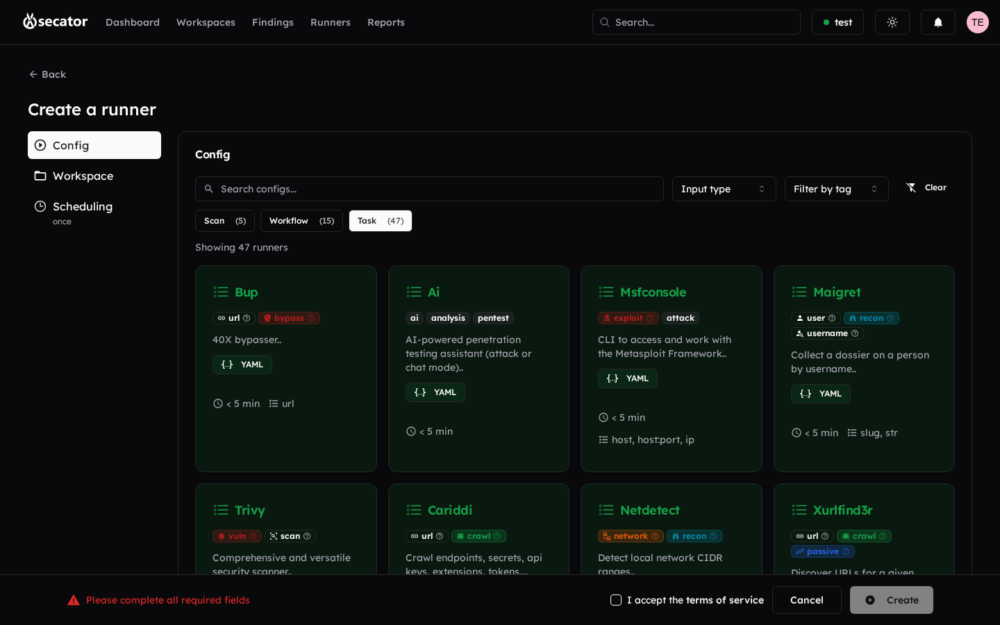
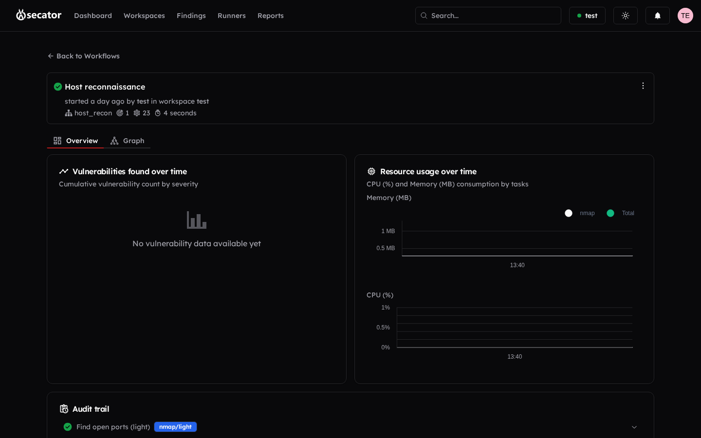

# Runners

The **Runners** page combines all three layers of automation in a unified table; the **Tasks**, **Workflows**, and **Scans** pages show only their own type. See [Platform overview](platform-overview.md) for the conceptual differences and [Available scans](available-scans.md) / [Available workflows](available-workflows.md) for the full catalog.

### List page (per type, or unified)

- **Run a [task / workflow / scan]** button opens the create form.
- **Table view** with dynamic columns, sortable headers, advanced filters, pagination, status badges, target chips, and an options summary.
- Click a status tag to filter the list by that status.
- Click a row to open the runner details.

### Create / Run page

Configure the run before launching:

1. **Workspace** — Required dropdown.
2. **Type** — If not pre-selected, pick Task / Workflow / Scan.
3. **Targets** — Multi-select with autocomplete from the workspace's existing targets.
4. **Raw HTTP request** (optional) — Paste a request; the parser will extract method, URL, headers, and body for tools that need one.
5. **Profiles** — Apply presets such as *aggressive*, *passive*, or *stealth* that adjust option groups in bulk. Recommended profiles are highlighted.

> [!tip]
> Pick `passive` first when scoping a new client engagement: it only queries third-party datasets (Wayback, Common Crawl, certificate transparency, …) and never sends a packet to the target. `aggressive` is for when you have full authorization and a lab/staging environment — it consumes [run hours](glossary.md#g-run-hours) much faster.

#### Available profiles

13 profiles ship with the platform. Pick the one whose intent matches your engagement; you can also **stack multiple profiles** (their options merge — later picks override earlier picks where they collide).

| Profile | Category | What it changes |
|---|---|---|
| **passive** | General | Pure passive — only queries external datasets (Wayback, Common Crawl, cert transparency). No packet ever leaves to the target. |
| **active** | General | The opposite of `passive` — disables passive sources and runs only active probes. |
| **full** | General | Turns on every optional feature (screenshots, secret hunting, headless browsing, deep crawls). |
| **aggressive** | Speed | High rate limits (`10 000 req/s`), no delay, short timeouts. Lab / staging only. |
| **insane** | Speed | LAN / stress profile (`100 000 req/s`). Extreme. |
| **polite** | Speed | Caps at 100 req/s, allows 5 retries, 10 s timeout — safe for production targets. |
| **paranoid** | Speed | Maximum stealth: 5 req/s, 5 s delay between probes. |
| **stealth** | Evasion | TCP SYN stealth scan (nmap `-sS`), no full handshake. |
| **sneaky** | Evasion | Packet fragmentation to evade IDS/IPS signatures. |
| **tor** | Evasion | Routes the scan through Tor (proxy auto-selection). |
| **all_ports** | Network | Scans **all 65 535 TCP ports** instead of the default top-1000. |
| **http_record** | Network | Stores every HTTP request/response and takes a screenshot of each page (requires Chromium). |
| **http_headless** | Network | Headless browser fetch — useful for JS-heavy apps where plain HTTP misses content. |
| **hunt_secrets** | Content | Enables `trufflehog` over HTTP responses across every applicable workflow. |

**Profile combination rule:** options come from the runner's defaults → then each selected profile is merged in order → then your manual edits in the Options panel override everything. If you tweak an option that a profile set, your value wins; if you uncheck the profile later, only the options you did **not** touch revert.

> [!caution]
> The `http_record`, `http_headless` and `full` profiles need Chromium installed on the worker host. Without it, every task that triggers a screenshot fails with *"the chrome browser is not installed"*. Pick a different profile or ask your administrator to install Chromium on the worker.

6. **Options** — A dynamic form generated from the chosen runner. Inputs include text fields, dropdowns, toggles, and file pickers. Each option has a tooltip with its description. The most useful ones are listed below.
7. **Options summary** — A compact card at the bottom of the form shows the final command being prepared.
8. **Terms of use** — Confirm the legal checkbox if the run targets new assets.
9. **Run** — Launch the runner and jump to its details page.

#### Common run options

The Options panel is auto-generated from the runner's YAML config, so the exact fields change per tool. The ones below appear on most runners and are worth knowing about:

| Option | What it does | When to use |
|---|---|---|
| **Rate limit** | Caps requests per second sent by the underlying tool. | Production targets; respecting a client's WAF; saving [run hours](glossary.md#g-run-hours). |
| **Threads** | Concurrent workers inside a single tool (e.g. number of parallel HTTP probes for `httpx`). | Faster scans on cooperative targets; lower it to be polite. |
| **Match codes** | Keep only HTTP responses whose status matches this list (e.g. `200,301,401`). | Triage during URL fuzzing — without it the table fills with 404s. |
| **Filter codes** | Drop HTTP responses whose status is in this list. | Noise reduction — exclude 404 / 403 from a directory bruteforce. |
| **Match regex / Filter regex** | Same idea but matched against the response body. | Detecting *content* fingerprints (login forms, error pages). |
| **User agent** | Custom `User-Agent` header for every request. | Bypass UA-based blocks; identify yourself in client logs. |
| **Headers** | Arbitrary HTTP headers (auth tokens, custom hosts, cookies). | Authenticated scans; testing virtual hosts. |
| **Depth** | Max recursion depth for crawlers. | Bound a passive crawl that would otherwise spider an entire SaaS app. |
| **Ports** | Comma-separated TCP ports for `nmap` / `naabu`. | Skip the default *top-1000* sweep — point at `80,443,8080,8443` for a web-only check. |
| **Top ports** | Use nmap's pre-curated *top N* most common ports. | Faster than scanning all 65 535. |
| **All ports** (`-` literal) | Scan every TCP port. | Full surface mapping; same as the `all_ports` profile. |
| **Skip host discovery** (`-Pn`) | Tell nmap to assume the target is up and skip the ping/ARP probe. | When the host blocks ICMP — without this nmap may report *"host down"* and abort. |
| **Timeout** | Per-task wall-time cap. | Run-hours protection on slow / unstable targets. |
| **Retries** | Re-send failed requests up to N times. | Lossy networks, rate-limited APIs. |

> [!tip]
> Several of these (rate-limit, retries, fragment, top-ports, …) are also bundled into [profiles](runners.md#available-profiles). When in doubt, pick the matching profile (`polite`, `paranoid`, `all_ports`, `stealth`) instead of editing each option by hand — same result, less risk of typos.

#### Scheduling a run

Every runner form has a **Scheduling** tab next to *Config* and *Workspace*. Pick how the run should repeat:

| Schedule | What happens |
|---|---|
| **Once** *(default)* | Run is launched immediately and never repeats. |
| **Every hour** | Recurs at the top of every hour after launch. |
| **Every day** | Daily at the same time of day. |
| **Every week** | Same day-of-week, same time. |
| **Every month** | Same day-of-month, same time. |
| **Custom…** | Free-text natural-language schedule (e.g. *"every Monday at 9am"*, *"every 6 hours"*). The platform parses it into a cron expression. |

Picking anything other than **Once** turns the runner into a [chore](glossary.md#g-chore) — visible on the *Chores* page once an owner has enabled the chore feature for that workspace ([Chores & owner features](chores.md)). Each scheduled run still respects the workspace's [run hours](glossary.md#g-run-hours) cap and [scope](glossary.md#g-scope).

### Runner details

Live monitoring and exploration of a run:

- **Header** with the runner name, type badge, status, and timestamps.
- **Run metrics** — Elapsed time, completed tasks, resource usage charts.
- **Findings tabs** — All findings produced by this runner, browsable by type just like the workspace findings page.
- **Timeline charts** — Vulnerabilities discovered over time, broken down by severity.
- **Logs** — Streaming logs while the run is in progress; expandable history afterward.
- **Task tree** (workflows / scans) — Hierarchical view of every task with its status, duration, and output. Click a task to inspect it.
- **Auto-refresh** — Every 20 seconds while running; stops when the run completes.

Runner actions in the header let you stop, restart, duplicate, or delete the run depending on its state.
