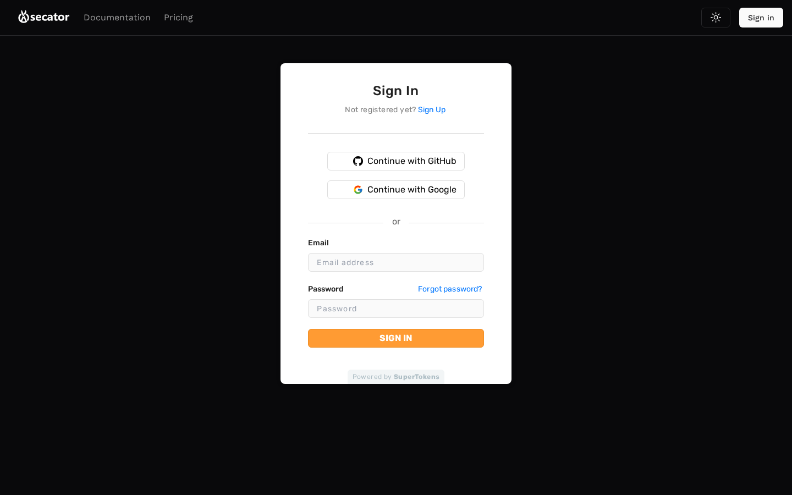

# Sign in & first login

Open the app and you will be redirected to the authentication page. You can sign in with:

- **Email + password** — Sign up the first time, then log in.
- **Google** or **GitHub** — Single sign-on through your provider.

After signing up by email, you may be asked to verify your address. Click the link in the verification email to continue. If the email does not arrive, check your spam folder or use the *Resend* button on the verification screen.

If you have no workspace yet, the dashboard will prompt you to **Create your first workspace**. A workspace is the unit that contains targets, runs, findings, and reports.
