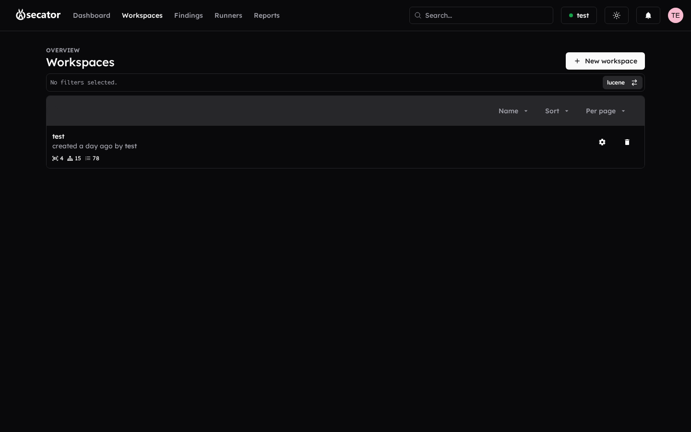
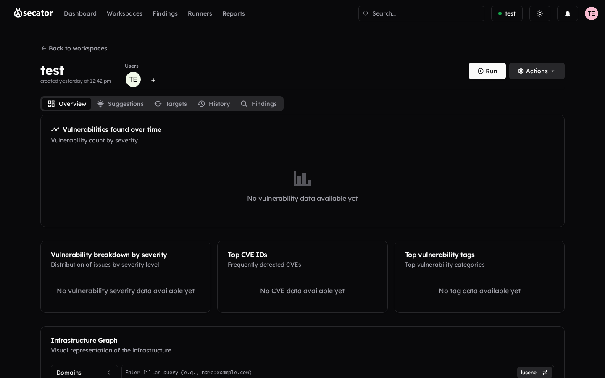

# Workspaces

A workspace groups everything related to one engagement: targets, runs, findings, reports, and the team that can see them.

### Workspace list

- View all workspaces you have access to in a paginated, sortable, searchable table.
- **Create workspace** opens a side sheet to set the name, description, and default options.
- Click a row to open the workspace details. Use the action menu to **edit** or **delete** a workspace.

### Workspace details

Workspace details are organized in tabs:

#### Overview

- See the workspace metadata, owner, and member avatars.
- **Run** button — jumps to the *Create runner* page pre-filled with this workspace.
- **Actions** menu — Manage targets, Import data, Open settings.

> [!tip]
> **Import data** lets you bulk-load assets and previous findings into the workspace without running a scan. Drop a JSON / CSV / TXT file produced by a previous secator run, or by another tool whose output format is supported, and the platform will deduplicate against existing items. Useful when continuing an engagement that started outside the platform, or when seeding a workspace with a target list from an Excel sheet.
- Vulnerability charts: count over time by severity, breakdown, top CVEs, top tags.
- **Infrastructure Graph** — 3D force-directed graph of domains, IPs, ports, certificates, and targets.

#### Suggestions

AI-powered recommendations for next scans, workflows, or targets based on your existing findings. See [AI suggestions](ai-suggestions.md) for the full reference.

#### Targets

The list of in-scope assets for this workspace. From here you can **add**, **edit**, **delete**, **filter** (by type, tags, status), **sort**, **paginate**, and **search** targets. See [Targets](targets.md) for details.

#### History

Activity timeline for the workspace. Shows runner counts (Scans, Workflows, Tasks) and a chronological view of when each runner was started.

#### Findings

The full Findings browser, scoped to this workspace. See [Findings](findings.md).

### Workspace settings

Open from the workspace's *Actions* menu. Settings are split into tabs:

- **General** — Name, description, *AI suggestions* toggle, *Monitor attack surface* toggle and frequency.
- **Users** — Invite a member by email, remove members. Available only for existing workspaces.
- **Notifications** — Per-event channels: vulnerability alerts (with severity threshold), scan / workflow / task started or finished, target added.
- **Display** — Reorder finding sections (move up/down) and toggle which finding types appear in the workspace: Exploits, Vulnerabilities, Subdomains, IPs, Ports, Records, User Accounts, Certificates, URLs, Domains, Tags.
- **Scope** — Manage the **allowlist** and **denylist** as plain patterns or regular expressions. Add, edit, and remove entries; existing targets in the workspace are shown alongside for reference.
